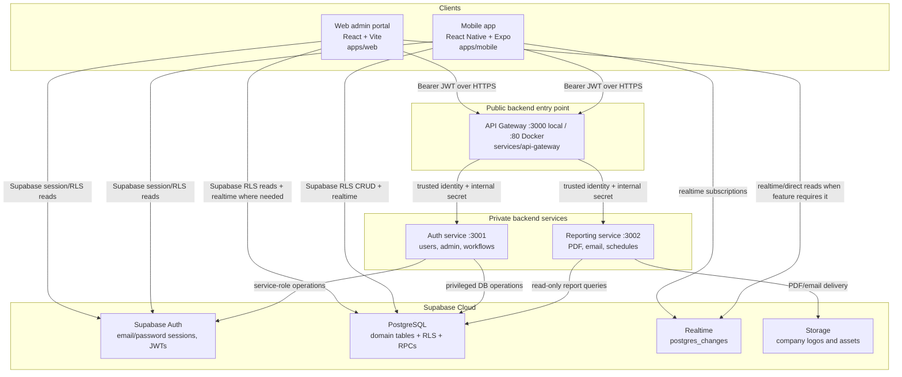

# Hadir.AI Architecture and Workflows

**Scope:** Android, iOS, web, backend services, Supabase, local development, and production deployment.

**Repository:** `AttendanceApp-SupaBase`

**Last reviewed:** 2026-10-01

This document describes the architecture that is implemented in the repository. It is intended for developers, QA, operations, and anyone making changes to the application. It summarizes behavior at module and workflow level; the source code remains the authority for exact validation rules and response shapes.

> Security note: this document intentionally contains no credentials. Never copy a service-role key, SMTP password, or other secret into documentation, client code, `EXPO_PUBLIC_*`, or `VITE_*` variables.

## 1. Product summary

Hadir.AI is a multi-tenant employee attendance and workforce operations platform.

- **Employees** use the mobile application and the employee-safe web portal for authentication, own attendance, leave, tickets, calendar visibility, notifications, and help.
- **Managers** use mobile and web administrative features, normally limited to their department unless a manager permission grants broader access.
- **Super admins** use mobile and web for tenant-wide administration, reporting, configuration, payroll, and governance.
- **Supabase** is the source of truth for identity, PostgreSQL domain data, row-level security (RLS), and realtime events.
- **The API gateway** is the public backend entry point. It proxies API calls and, when configured, verifies Supabase JWTs before forwarding a trusted identity to internal services.
- **The auth service** owns privileged business operations and uses the Supabase service-role key server-side.
- **The reporting service** reads tenant data, builds PDFs, stores them temporarily, emails them, and runs scheduled monthly delivery.

## 2. System architecture



### Request path rules

| Operation | Normal path | Security boundary |
|---|---|---|
| Sign in | Client → gateway `/api/auth/login` → auth service → Supabase Auth; client then establishes its own Supabase session | Supabase credentials and active `public.users` profile |
| Client-side attendance, leave, tickets, calendar, notifications | Client → Supabase JS with anon key + user JWT | PostgreSQL RLS and tenant policies |
| Admin CRUD | Client → gateway → auth service → Supabase service role | Gateway JWT identity, backend role/department checks, tenant scope |
| Reports | Client → gateway → reporting service → PostgreSQL reads → PDF/storage/email | Super-admin verification and company ownership |
| Realtime | Client → Supabase Realtime | JWT/RLS-filtered subscriptions |

The browser and mobile app may send legacy identity headers for compatibility, but the configured gateway does not trust client-supplied role or company fields. It strips those headers, validates the bearer token, loads the caller's `users` row and manager permissions, and stamps a trusted context for internal services. If gateway Supabase variables are missing, it deliberately falls back to legacy pass-through mode; production must configure them.

## 3. Repository map

```text
apps/
  web/                  React/Vite admin and marketing portal
  mobile/               React Native/Expo Android + iOS app
services/
  api-gateway/          Public Express reverse proxy and JWT boundary
  auth-service/         Auth, tenant, admin, workflow and payroll APIs
  reporting-service/    PDF reports, SMTP delivery and monthly scheduler
shared/permissions/     Shared permission catalog and tests
supabase/
  migrations/           Ordered production schema/RLS/RPC migrations
  legacy_migrations/    Historical migrations retained for reference
  current.sql           Current schema snapshot/reference
  bootstrap.sql         Initial bootstrap SQL
scripts/                Repository utilities
docs/                   Existing product, backend and setup documentation
docker-compose.yml      Coolify production backend topology
start-services.*        Local service startup helpers
```

### Important entry points

| Area | Entry point |
|---|---|
| Web | `apps/web/src/main.jsx` → `AppRouter.jsx` |
| Mobile | `apps/mobile/App.js` → `AppNavigator.js` |
| Gateway | `services/api-gateway/index.js` |
| Auth | `services/auth-service/index.js` |
| Reporting | `services/reporting-service/index.js` |
| Shared permissions | `shared/permissions/catalog.js` and `.cjs` |
| Database evolution | `supabase/migrations/*.sql` |

## 4. Identity, roles, and tenant isolation

### Identity lifecycle

1. A user signs in using an email or username plus password.
2. The auth service resolves a username to its canonical email when necessary and validates the credentials through Supabase Auth.
3. The client obtains a Supabase access-token session and loads its `public.users` profile.
4. The client can request tenant metadata synchronization through `/api/auth/sync-metadata`; this keeps JWT `user_metadata` aligned with the canonical profile.
5. Gateway requests send `Authorization: Bearer <access token>`.
6. The gateway calls Supabase Auth `getUser`, reads the caller's active `public.users` row using the caller's RLS context, loads manager permissions where applicable, and attaches the trusted identity.
7. The auth service derives company and department scope again. Request bodies must not be used to select another tenant.

### Roles

| Role | Normal surfaces | Capabilities |
|---|---|---|
| `employee` | Android/iOS + web | Own attendance, leave, tickets, calendar visibility, notifications and profile/auth settings |
| `manager` | Mobile + web | Department-scoped users, attendance, leaves, sites, tickets and workflows according to `manager_permissions` |
| `super_admin` | Mobile + web | Full tenant administration, reports, company settings, manager permissions, payroll and cross-department operations |

The shared permission catalog is the intended single source for feature gating. Web routes use `PermissionRoute`; mobile screens use `hasPermission`/`hasAnyPermission`. Backend checks are mandatory even when a client hides a screen.

### Tenant rules

- `companies` is the tenant table; most domain rows carry `company_id`.
- `public.users.company_id` is canonical for the caller's tenant.
- `users.department_id` is the canonical department relationship; the older text `users.department` remains for compatibility and is synchronized by database triggers/migration helpers.
- Managers are department-scoped by default. Cross-department operations require an explicit permission and still pass backend scope checks.
- RLS policies prevent a client JWT from reading or mutating another company.
- The service role bypasses RLS and is therefore restricted to backend processes only.

## 5. Web application (`apps/web`)

### Stack and bootstrap

- React 18, Vite, React Router, Zustand, Axios, Supabase JS, Tailwind/PostCSS, Recharts and Framer Motion.
- `main.jsx` mounts `BrowserRouter` and `AppRouter`.
- `AppRouter` bootstraps `useAuthStore`, defines public/auth routes, and wraps protected routes in `Protected`, `PermissionRoute`, `AppShell`, and shared UI providers.
- `core/config/api.js` builds an absolute gateway URL from `NEXT_PUBLIC_API_URL` or `VITE_API_GATEWAY_URL`.
- `core/api/client.js` attaches the current Supabase access token to Axios requests and logs structured failures without exposing passwords.
- `core/config/supabase.js` creates the browser Supabase client using only the public URL and anon key.

### Route and function map

| Route | Functionality | Typical access |
|---|---|---|
| `/` | Marketing/landing page | Public |
| `/login`, `/forgot-password`, `/reset-password` | Authentication and password recovery | Public |
| `/onboard` | Company onboarding/status | Public, secret-gated server-side |
| `/dashboard` | KPI dashboard | Authenticated managers/admins |
| `/users` | User list, profile edits, role/status/department operations | Permission-gated |
| `/departments` | Department overview, create/rename/delete and employee expansion | Permission-gated |
| `/sites` | Site/geofence records and employee-site assignments | Permission-gated |
| `/attendance` | Attendance administration and manual records | Permission-gated |
| `/leaves` | Leave review, creation and approval/rejection | Permission-gated |
| `/tickets` | Ticket creation, assignment, close/reopen | Permission-gated |
| `/calendar` | Shared events and visibility | Permission-gated |
| `/notifications` | Notification list, unread count and read/delete actions | Permission-gated |
| `/analytics` | Attendance and workforce charts/KPIs | Permission-gated |
| `/reports` | Generate, preview, download, email, schedule and delete PDFs | Super-admin/report permission |
| `/manager-permissions` | Grant/revoke manager permissions and inspect audit logs | Super admin |
| `/approval-workflows`, `/work-mode-requests` | Workflow configuration and request processing | Super admin or granted permission |
| `/payroll`, `/payroll/employees`, `/payroll/reports`, `/payroll/periods/:id` | Payroll profiles, periods, calculation, review, approval, lock and reports | Super admin |
| `/settings` | Tenant/application settings | Permission-gated |

### Web login workflow

1. `LoginPage` calls `useAuthStore.login(identifier, password)`.
2. The store first calls gateway `/api/auth/login`; the service normalizes username/email and returns the canonical user profile.
3. The browser calls `supabase.auth.signInWithPassword` to create the local session.
4. The store loads `public.users`, manager permissions, and tenant claims.
5. The store optionally calls metadata sync when JWT claims differ from the profile.
6. `Protected` allows the shell to render; `PermissionRoute` controls each feature route.
7. Logout signs out of Supabase and clears the Zustand user state.

If the gateway is unavailable during development, the store has a deliberate Supabase direct-login fallback. Production should not rely on that fallback: configure a public HTTPS gateway URL and deploy again because Vite variables are build-time values.

### Web data and UI patterns

- `adminService.js` is the API façade for dashboard, users, departments, sites, attendance, leaves, tickets, calendar, notifications, settings, workflows, reports and payroll.
- Direct Supabase is used for session hydration, profile/permission reads and feature-specific RLS-safe reads where appropriate.
- Shared components provide shell navigation, permission gates, tables, dialogs, forms, skeletons, KPI cards and chart primitives.
- Analytics uses `useAnalyticsMetrics` and chart components; if the analytics endpoint is unavailable, client-side aggregation can be used for supported metrics.
- Long-running report calls use extended Axios timeouts and treat PDF responses as blobs.

## 6. Mobile application (`apps/mobile`)

Android and iOS share one React Native/Expo codebase. Platform-specific behavior is selected by Expo/React Native, `Platform.OS`, and the native configuration in `apps/mobile/app.json` and `android/`.

### Common mobile bootstrap

`App.js` initializes gesture handling first, clears obsolete local caches, checks Expo OTA updates in production, and mounts:

```text
GestureHandlerRootView
  ThemeProvider
    AuthProvider
      CompanyProvider
        AppNavigator
```

`AuthProvider` owns Supabase session rehydration, profile loading, JWT metadata synchronization, manager permissions, realtime subscriptions, and location-monitoring lifecycle. `CompanyProvider` loads company branding/logo data when the authenticated company changes.

`AppNavigator` switches between `AuthNavigator` and `DrawerNavigator`. Password-reset deep links use the `hadirai://reset-password` scheme, explicitly exchange the PKCE code, and navigate to `ResetPasswordScreen` without treating the recovery session as a normal login.

### Mobile navigation by role

| Role | Main screens/functions |
|---|---|
| Employee | Dashboard, attendance history, authentication/biometric settings, leave requests, calendar, theme, notifications, own tickets, help, geofencing status (mobile); dashboard, own attendance/leave, tickets, calendar visibility and notifications (web) |
| Manager | Admin dashboard, HR dashboard when permitted, employee management, manual attendance, ticket management, calendar, notifications, leave workflows, work-mode requests, geofencing, optional create/delete user, help |
| Super admin | All manager functions plus reports, attendance settings, company logo/settings, full user/department/site/workflow/permissions and payroll access |

`DrawerNavigator` uses a modern Reanimated-compatible front drawer. `MainNavigator` conditionally registers screens based on the role and permission catalog, so navigation visibility and backend authorization agree.

### Android configuration

- Native package and launcher resources live under `apps/mobile/android`.
- Location, biometric/fingerprint, notifications, and Google Maps permissions/configuration are declared through Expo config and Android manifests.
- The Android emulator reaches a local gateway through `http://10.0.2.2:3000` when no production `extra.apiGatewayUrl` is configured.
- Physical Android devices need a reachable LAN address for local development, or the deployed HTTPS gateway for a release build.
- Android builds are produced through Expo/EAS; production uses an Android App Bundle and preview uses an APK according to `eas.json`.

### iOS configuration

- Bundle identifier, build number, tablet support and permission descriptions are in `apps/mobile/app.json`.
- Location background/foreground, Face ID and photo-library usage descriptions are declared in `ios.infoPlist`.
- The iOS simulator reaches local gateway `localhost:3000` when no configured gateway URL is present; physical devices need a LAN address or HTTPS deployment.
- iOS builds use Expo/EAS and the same JS business logic as Android.

### Mobile environment resolution

- Development can use `EXPO_PUBLIC_SUPABASE_URL` and `EXPO_PUBLIC_SUPABASE_ANON_KEY` in `apps/mobile/.env`.
- EAS/release builds read `extra.supabaseUrl`, `extra.supabaseAnonKey`, and `extra.apiGatewayUrl` from Expo config.
- Only the Supabase anon key belongs in a mobile binary. Never add `SUPABASE_SERVICE_ROLE_KEY` to mobile or web configuration.
- Restart Expo after changing environment/config values; they are bundled into the JS/native build.

### Mobile feature workflows

#### Authentication and recovery

1. Login accepts a username or email; normalization resolves it to the canonical email.
2. Supabase Auth creates/persists the session in an AsyncStorage adapter.
3. The profile is loaded from `public.users`, with safe fallback to the last valid profile or complete JWT tenant metadata during transient read failures.
4. Manager permission rows are loaded and cached in the in-memory user model.
5. Optional biometric authentication uses `expo-local-authentication`; credentials/preferences are handled by the auth preference and credential storage helpers.
6. Forgot-password links use the `hadirai://` deep link and PKCE exchange described above.

#### Attendance and geofencing

1. The app requests location permission and obtains a current/progressive location.
2. `geofenceService` resolves allowed company, department, site or office locations and calculates distance using the shared Haversine helpers.
3. Work-mode rules decide whether location is required (`in_office`, hybrid/semi-remote, or fully remote).
4. Check-in/check-out writes to `attendance_records`; database RLS and the geofence guard validate tenant/location constraints server-side.
5. While checked in, `locationMonitoringService` polls location, handles outside-radius warnings, can notify a manager, and can perform automatic checkout when the attendance configuration enables it.
6. `realtimeAttendance` updates screens when an attendance row changes.
7. Admins manage office/site settings through the gateway/RPCs; employees only validate and record their own attendance.

#### Leave management

- Employee forms create requests with type, dates, half-day options, reason and category.
- Leave settings and balances are loaded from `leave_settings`/`leave_balances`, with calculated remaining balances.
- Employees see their own requests; managers see department requests; super admins see the tenant.
- Processing transitions a request to approved/rejected with actor and notes, subject to backend scope and RLS.
- Notifications and approved-date helpers update the employee experience.

#### Tickets, calendar and notifications

- Tickets are created by employees/admins, routed by department/category, assigned by privileged users, and closed/reopened through the gateway or RLS-safe service helpers.
- Calendar events are stored in Supabase with visibility rules and notification fan-out. The legacy AsyncStorage fallback exists for resilience when direct persistence is unavailable.
- Notification helpers create/read/delete rows, calculate unread counts, and map notification payloads to the correct screen. Realtime subscriptions keep the mobile notification center current.

#### Workforce administration and work modes

- Managers/admins can create/update/delete employees according to permission and department scope.
- Work-mode changes can be updated directly for privileged users or submitted as `work_mode_requests` for approval.
- Employee-site assignments must match department/company integrity rules.
- Company settings allow super admins to load/update tenant branding, including logo storage.

#### Reports and exports

- Mobile analytics calculates attendance rates, average hours, quick stats and period summaries from Supabase records.
- Super admins can request a server PDF through `/api/reports/generate`, download it, and open/share it using Expo file/print/share capabilities.
- Local CSV/HTML export helpers support attendance and leave exports when a PDF is not required.

## 7. Backend services

### API gateway (`services/api-gateway`)

The gateway is an Express reverse proxy. It does not own domain mutations.

Responsibilities:

- CORS and JSON/form parsing.
- Request logging with password redaction.
- JWT verification and identity derivation when `SUPABASE_URL` and `SUPABASE_ANON_KEY` are configured.
- Stripping untrusted `x-user-context` and `x-internal-auth` headers.
- Forwarding trusted identity and the optional `INTERNAL_API_SECRET` to internal services.
- Proxying `/api/auth/*`, `/api/admin/*`, and `/api/reports/*`.
- Liveness at `/health`; deep readiness at `/health?deep=1` probes auth and reporting.

Gateway groups:

- `/api/auth`: login, onboarding status/company onboarding, metadata sync, username checks, user mutations, departments/positions, current permissions, and employee work-mode requests.
- `/api/admin`: dashboard/analytics, users, departments, sites and employee sites, attendance, leaves, tickets, calendar, notifications, settings, approval workflows, work-mode requests, and payroll.
- `/api/reports`: generation, email, preview/download, history/latest, recipients, schedule, delivery logs, send-now, and reporting health.

### Auth service (`services/auth-service`)

The auth service is the privileged domain layer. It loads its service-role Supabase client from server-only environment variables.

Major modules:

- `lib/loginNormalize.js`: username/email normalization.
- `lib/tenantScope.js`: derives and enforces company/department scope.
- `lib/permissions.js`: permission groups, checks and audit logging.
- `lib/profileAccess.js`: department versus tenant-wide profile access.
- `lib/authMetadata.js`: synchronizes Supabase `user_metadata`.
- `lib/departmentService.js`: canonical department lookup/creation.
- `lib/siteValidation.js`: site and employee-site integrity.
- `lib/approvalEngine.js`: approval workflow resolution.
- `lib/payrollEngine.js`: payroll calculations and state transitions.
- `lib/notificationHelper.js`: server-side notification creation.

The service rejects cross-company requests, prevents self-escalation of administrative access, protects super-admin operations, and records relevant manager permission/audit changes.

### Reporting service (`services/reporting-service`)

Startup mounts `/api/reports`, starts the monthly scheduler, and schedules cleanup of expired report files.

Report pipeline:

1. Verify the caller resolves to an active `super_admin` with a company.
2. Validate the requested date range (`daily`, `weekly`, `monthly`, `yearly`, `all`, or custom ISO dates).
3. Query users, attendance, leaves, tickets, company branding and report settings.
4. Aggregate metrics and department sections.
5. Generate a PDF with PDFKit.
6. Store the PDF under the service data volume and write report metadata/index data.
7. Optionally send it to active super-admin recipients using SMTP.
8. Enforce company ownership for preview/download/delete/history operations.

Reports are retained for a limited period (the service cleanup defaults to seven days). In Coolify, the reporting data volume is persistent; in a disposable local process it is not a durable archive.

## 8. Supabase data model and database workflow

### Domain groups

| Group | Main tables |
|---|---|
| Tenant/identity | `companies`, `users`, `departments`, `manager_permissions`, `audit_logs` |
| Attendance/location | `attendance_records`, `attendance_config`, `company_offices`, `locations`, `sites`, `employee_sites`, `employee_locations` |
| Leave | `leave_requests`, `leave_settings`, `leave_balances` |
| Operations | `tickets`, `calendar_events`, `notifications` |
| Onboarding | `signup_requests` |
| Workflows | `approval_workflows`, `approval_workflow_steps`, `approval_request_actions`, `work_mode_requests`, `approval_audit_logs` |
| Reporting | `report_audit_logs` and company report schedule fields |
| Payroll | `employee_payroll_profiles`, `payroll_periods`, `payroll_records`, `payroll_earnings`, `payroll_deductions`, `payroll_audit_logs` |

### RLS, triggers and RPCs

- RLS is enabled on client-facing tables. Policies use the authenticated JWT and helper functions such as caller company, role, department and active-state resolution.
- Attendance policies and `attendance_geofence_guard` enforce company/location rules at the database boundary, not only in the mobile UI.
- Department normalization and user department synchronization triggers preserve compatibility while migrating from text-only departments to foreign keys.
- RPCs provide controlled operations such as office location retrieval/update, department geofence retrieval/update, notification creation, and other tenant-aware operations.
- Migrations add company columns, tenant-scoped policies, department/site normalization, workflows, payroll, and geofence enforcement in timestamp order.

### Database change workflow

1. Add a new timestamped SQL migration under `supabase/migrations`.
2. Make it idempotent where practical and preserve existing tenant data.
3. Add/adjust RLS policies, indexes, triggers and RPC grants in the same migration when required.
4. Test against a non-production Supabase project or local Supabase stack.
5. Inspect existing rows and migration order before applying to production.
6. Deploy the migration before deploying clients that depend on new columns/routes.

`supabase/legacy_migrations` is historical context; new production changes belong in `supabase/migrations`.

## 9. End-to-end business workflows

### Company onboarding

1. Web user opens `/onboard`.
2. Frontend checks `/api/auth/onboarding-status`.
3. First-company creation calls `/api/auth/onboard-company` with the onboarding secret.
4. Auth service creates the company and initial super-admin/profile records using the service role.
5. Subsequent company creation is gated by `COMPANY_ONBOARDING_SECRET` and server validation.
6. The new user signs in, receives tenant metadata, and sees the tenant-scoped portal/mobile experience.

### Manager leave approval

1. Employee creates a leave request through mobile/Supabase RLS.
2. The request appears in the manager's department-scoped list.
3. Manager submits approval/rejection through gateway `/api/admin/leaves/:id`.
4. Auth service resolves the manager from the trusted gateway context, verifies department/company scope and current request state, then updates the row.
5. Balance/notification behavior is applied and the employee receives the updated status through query/realtime refresh.

### Attendance check-in and automatic checkout

1. Employee selects check-in; the app resolves work mode and location permissions.
2. Allowed site/office geofences are loaded and distance is calculated.
3. The check-in insert is sent with the user JWT; RLS and the database geofence trigger validate it.
4. Realtime updates the dashboard/history.
5. If auto-checkout is enabled, location monitoring continues while checked in.
6. Leaving the permitted radius triggers warning/manager notification and, where configured, a server-validated checkout.

### Report generation and delivery

1. Super admin chooses a report period in web or mobile.
2. Client calls the gateway with the current Supabase bearer token.
3. Gateway derives identity; reporting service verifies super-admin/company access.
4. Report data is aggregated from Supabase, converted to PDF, stored, and optionally emailed.
5. Client previews/downloads the PDF through the gateway. A seven-day cleanup policy removes expired files.

## 10. Deployment and environment configuration

### Local development

Install dependencies in the root and each runnable package (`apps/web`, `apps/mobile`, `services/api-gateway`, `services/auth-service`, and `services/reporting-service` when used).

Typical processes:

```text
Terminal 1: npm run dev                 # web, http://localhost:5173
Terminal 2: npm run dev:gateway         # gateway, http://localhost:3000
Terminal 3: npm run dev:auth            # auth service, http://localhost:3001
Terminal 4: npm run dev:reporting        # reporting service, if needed, :3002
Terminal 5: cd apps/mobile && npm start  # Expo Metro/dev tools
```

The root `start-services.ps1` and `start-services.sh` provide alternative startup orchestration; inspect them before using them in a new environment.

### Environment ownership

| File/service | Values that belong there |
|---|---|
| Root `.env` / Coolify compose environment | Supabase URL/service role, SMTP, onboarding secret, internal secret, CORS, build SHA |
| `services/auth-service/.env` | Supabase URL/service role, onboarding/internal secrets, port/host for local execution |
| `services/api-gateway/.env` | Supabase URL/anon key, gateway URLs, CORS, internal secret, port/host for local execution |
| `services/reporting-service/.env` | Supabase URL/service role, SMTP and report service settings |
| `apps/web/.env` or Vercel/Coolify frontend variables | Public Supabase URL/anon key and public gateway URL only |
| `apps/mobile/.env` / Expo `extra` / EAS environment | Public Supabase URL/anon key and API gateway URL only |

Environment files are ignored by Git. Each service loads dotenv relative to its own working directory in local execution, while Docker Compose injects variables explicitly into each container.

### Coolify backend deployment

`docker-compose.yml` defines three containers:

- `auth-service` exposed only to the internal Docker network on port 3001.
- `reporting-service` exposed internally on port 3002 with a persistent report-data volume.
- `gateway` exposed to Coolify/Traefik on container port 80 and assigned the public HTTPS domain.

Docker DNS connects the gateway to `http://auth-service:3001` and `http://reporting-service:3002`. Do not publish internal service domains or put the service-role key in the gateway container. Coolify health checks use `/health?deep=1`.

### Web deployment

Deploy `apps/web` as a Vite static application. Set the public gateway URL to the HTTPS gateway domain, not `localhost`, then rebuild. `VITE_*` and `NEXT_PUBLIC_*` values are embedded at build time. Set backend `ALLOWED_ORIGINS` to the exact web origin(s), including scheme and without a trailing slash.

### Android/iOS deployment

Use Expo/EAS profiles from `apps/mobile/eas.json`:

- `development`: development client.
- `preview`: internal Android APK distribution.
- `production`: Android App Bundle and production EAS update channel.

The app's Expo `extra` configuration supplies the production API gateway and public Supabase values. OTA updates are checked on production cold start; failures are intentionally non-fatal.

## 11. Testing and validation

### Automated checks

From the repository root:

```bash
npm test
npm run build --prefix apps/web
```

The root test script covers web geofence utilities, auth-service tests, and shared permission catalog tests. Auth-service also contains focused tests for payroll, requester resolution, and site validation. Run a package's own tests/build scripts when changing that package.

For a database change, validate SQL/migration ordering with the Supabase CLI and test RLS using real authenticated users from separate companies/roles.

### Local smoke tests

Check process liveness:

```text
GET http://localhost:3000/health
GET http://localhost:3000/health?deep=1
GET http://localhost:3001/health
GET http://localhost:3001/health?deep=1
GET http://localhost:3002/health
```

Then verify:

1. Web landing page loads and `/login` is reachable after a hard refresh.
2. Employee, manager and super-admin login paths behave correctly.
3. A manager cannot see or mutate another department/company.
4. A super admin can access reports/settings/payroll; an employee sees only the employee-safe web modules and cannot access administrative routes or data.
5. Mobile login, session restore, logout and password recovery work on both platforms.
6. Attendance geofence accepts an allowed coordinate, rejects an out-of-radius coordinate, and respects remote/hybrid work mode.
7. Leave request/approval, tickets, calendar visibility, notifications and realtime refresh work.
8. Report generation returns a valid PDF, preview/download works, and email delivery is reported accurately.

### Role/security test matrix

| Scenario | Employee | Manager | Super admin |
|---|---:|---:|---:|
| Own profile/session | Allow | Allow | Allow |
| Own attendance/leave/ticket | Allow | Allow | Allow |
| Department attendance/leaves | Deny | Allow only assigned scope | Allow tenant |
| Create/delete users | Deny | Only explicitly granted operations | Allow tenant |
| Department/site administration | Deny | Assigned scope/permission | Allow tenant |
| Reports/payroll | Deny | Deny unless explicitly supported | Allow |
| Cross-company data access | Deny | Deny | Deny outside own tenant |

## 12. Safe change workflow

1. Identify the surface and source-of-truth layer: UI, client service, gateway route, auth service, reporting service, or migration/RLS.
2. Change the backend/database contract first when a new field or rule is required.
3. Update both clients if the behavior is shared; do not implement security-critical rules only in React/React Native.
4. Add or update unit tests for pure logic and role/tenant tests for protected behavior.
5. Run the affected dev servers and test the complete workflow with at least one employee, manager, and super-admin account.
6. Run root tests and the web production build.
7. Apply database migrations in a non-production project, smoke-test, then deploy backend and clients in dependency order.
8. Verify production health endpoints, CORS, public gateway URL, Supabase configuration, and mobile release config.

### Where common changes belong

| Requested change | Primary files |
|---|---|
| Web page/layout | `apps/web/src/features/**/pages`, `shared/components`, `AppRouter.jsx` |
| Web API call | `apps/web/src/features/admin/services/adminService.js` or `core/api/client.js` |
| Mobile screen/navigation | `apps/mobile/screens`, `core/navigation`, `shared/constants/routes.js` |
| Mobile attendance/geofence | `apps/mobile/features/geofencing`, `features/attendance`, `utils/location.js` |
| Mobile auth/session | `apps/mobile/core/contexts/AuthContext.js`, `features/auth`, `core/auth` |
| Shared permission | `shared/permissions/catalog.*`, then client gates and backend check |
| Privileged API behavior | `services/api-gateway/routes`, `services/auth-service/routes` and `lib/` |
| PDF/report/email behavior | `services/reporting-service` |
| Table/RLS/RPC | New `supabase/migrations/<timestamp>_*.sql` |
| Deployment/config | `docker-compose.yml`, service Dockerfiles, `apps/web/.env.example`, `apps/mobile/app.json`/`eas.json` |

## 13. Operational notes and known pitfalls

- A deployed web build must never contain `localhost` as its gateway URL.
- A physical Android/iOS device cannot use the host machine's `localhost`; use a LAN gateway during development or the production HTTPS gateway.
- The web and mobile apps use public anon credentials; the service-role credential belongs only in auth/reporting server environments.
- `ALLOWED_ORIGINS` controls browser CORS. Mobile and server-to-server requests generally have no browser `Origin` header.
- Gateway `/health` proves the process is alive; `/health?deep=1` verifies the auth dependency and reports reporting-service status as a soft dependency.
- Reporting files are temporary artifacts, not a long-term document archive.
- Supabase direct reads are still subject to RLS even when the UI appears to filter by company; never remove the database policies because a client filter exists.
- Existing documentation under `docs/` contains useful historical workflows, but verify behavior against current source when it conflicts with this guide—especially around gateway authentication and newer payroll/workflow migrations.
- `apps/mobile/utils/` contains compatibility and domain helpers alongside newer `core/` and `features/` modules. Check imports before moving code; some legacy helpers still implement active fallback paths.

## 14. Reference files

- Root setup: `README.md`, `SETUP.md`, `start-services.ps1`, `start-services.sh`
- Backend workflow reference: `docs/BACKEND_TECHNICAL_WORKFLOW.md`
- Product/use-case reference: `docs/PRODUCT_DOCUMENTATION_AND_USE_CASES.md`
- Web workflow reference: `hisab ai web portal workflow.md`
- Mobile OTA notes: `apps/mobile/OTA_UPDATES.md`
- Backend deployment: `docker-compose.yml`
- Environment templates: `.env.example`, `apps/web/.env.example`, `apps/mobile/.env.example`, and each service's `.env.example`
